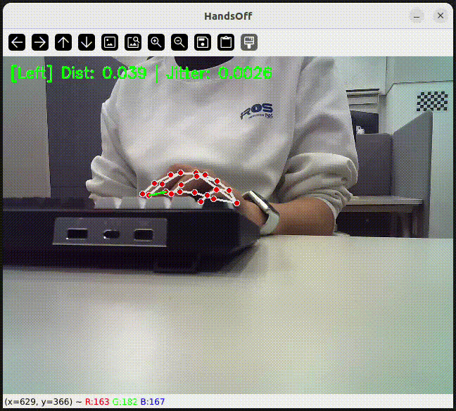
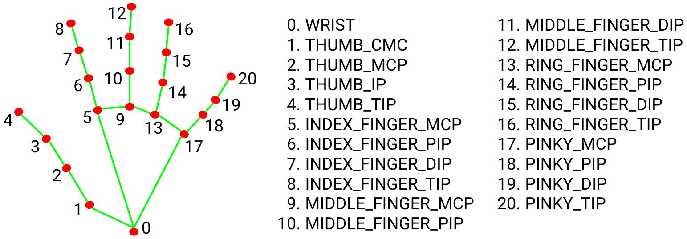

# 🖐️ HandsOff – Real-Time Skin-Picking Awareness

> A simple computer vision toy project designed to increase awareness of unconscious skin-picking behavior during everyday desk work.

<p align="center">
  
  
</p>

If skin-picking behavior is detected, 🔴 "STOP PICKING!" alert (with Highlighted finger connection line)

---

## Background

**Skin Picking Disorder** is a mental health condition characterized by repetitive picking of one's skin that can lead to tissue damage and distress.

One of the primary behavioral treatment approaches is **increasing awareness** of the behavior pattern.  

When users recognize that they are engaging in this pattern, they can:

Perform a competing response, Identify triggers or Interrupt the urge cycle to overcome this pattern.

This project aims to:

- **Detect** sustained and micro scratching patterns **in real time**
- **Provide immediate visual feedback** to increase behavioral awareness
- **Filter out** global hand movement **in daily desk** activities,

This is not a medical diagnostic tool. It is an experimental awareness-support toy project.

---

## How to Run

#### Dependencies
- ```OpenCV``` for Video capture and visualization  
- ```MediaPipe == 0.10.9``` for robust 21-point hand landmark detection 
- ```PyTorch``` for tensor-based behavior pattern analysis  
- ```NumPy < 2.0```
- ```Python 3.8+```
- This project works both with and without a GPU. (When a GPU is available, MediaPipe leverages OpenGL for graphics acceleration.)
  
#### How to run

```bash
python demo.py --camera [camera_index]
```

if you don't have webcam or external camera, Try to connet using e.g., ```Droidcam```

---

## Detection Pipeline

**1. Hand Landmark Detection with MediaPipe**
   
   MediaPipe extracts 21 hand keypoints / Supports up to 2 hands simultaneously

**2. Keypoint Selection**
   
   Key landmarks used: Thumb tip (index 4), Index tip (index 8), Middle tip (index 12), Wrist (index 0)

 <p align="left">
  
 </p>
 
**3. Feature Engineering**

A. Pinch Detection
  
   Distance between thumb and index/middle finger:

  - distance < ```PINCH_DISTANCE_THRESHOLD``` → Pinch state

B. Sustained Pinch Ratio

   Within the last `BUFFER_SIZE` frames:

   - ```pinch_ratio``` > 0.8

   Ensures the contact is sustained rather than momentary.

C. Local Jitter (Scratching Intensity)

   Standard deviation of relative thumb–finger movement ```local_jitter```:

  - Too low (<```LOCAL_JITTER_MIN```)→ static contact  
  - Mid-range  (<```LOCAL_JITTER_MAX```) → repetitive micro scratching motion  
  - Too high (>= ```LOCAL_JITTER_MAX```) → general movement  

D. Global Stability (Wrist Jitter)

  Standard deviation of wrist position:
    
  - ```wrist_jitter``` < ```GLOBAL_WRIST_JITTER_MAX```
    
  Prevents false positives when the whole hand is moving.

---

## Reference
 [1] https://www.health.harvard.edu/blog/picking-your-skin-learn-four-tips-to-break-the-habit-2018112815447
 
 [2] https://www.nhs.uk/mental-health/conditions/skin-picking-disorder/
 
 [3] https://skinandcancerinstitute.com/dermatologists-guide-treating-skin-picking-disorder/
 
 [4] J. E. Grant and S. R. Chamberlain, “Prevalence of skin picking (excoriation) disorder,” Journal of Psychiatric Research, vol. 130, pp. 57–60, 2020.
